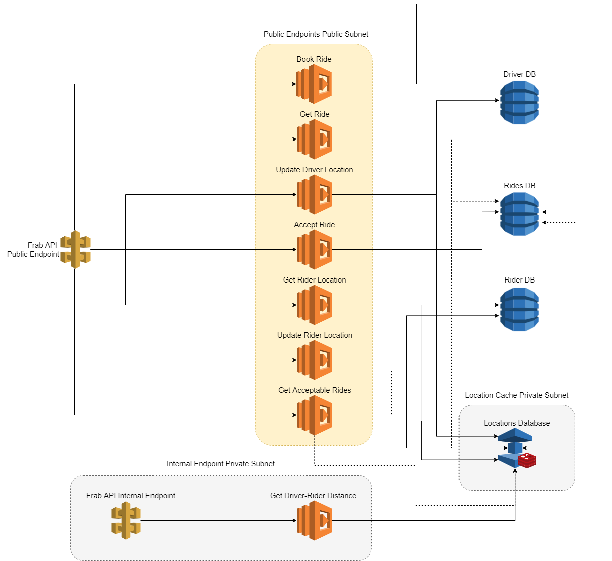

# AWS -- frab-api

## Introduction

The Frab API is a side-project created primarily using AWS SAM. It deploys similar APIs that are used in Ride-Hailing
Apps. These APIs can be like accept_ride_request, book_ride, and more. The functionality of these APIs are defined below.

We've also added a Lambda Authorizer so you can only execute these APIs if you have the header token required to be
authorized to execute the request.

The project was based on the concept of developing a backend platform of a ride-hailing service dedicated for front-liners
like medical workers, hospital staff, and support personel.

This project contains the API backend endpoints of a ride-hailing app. We've made complete use of AWS services to make this application highly-available, fault-tolerant, reliable, and cost-optimized.



To make it possible, we've made complete use of API Gateway, AWS Lambda, and AWS DynamoDB. These are all Serverless
services which should make our application completely fault-tolerant. To make the application perform extremely well, we've made use of AWS Elasticache Redis as our database for the locations of each user of the app. Redis has this feature called Geospatial Indexing that allows you to store location values (Latitude, Longitude) and has predefined functions for doing calculations on these location values. With this, we've achieved execution times of 30-50ms on our Lambda functions during our load testing.

We've also included a internal API endpoint (distance_driver_rider) that can only be accessed by our Lambda function in a private subnet in our VPC. To test the internal API endpoint, you will have to deploy a Bastion EC2 host in the public subnet and another EC2 host in the private subnet. You then have to SSH into the EC2 host in the private subnet and execute the API from there.

Despite the use of Serverless services, it's not yet completely fault-tolerant to the Region level. The APIs are only deployed into 1 AWS region. If we were to improve it, we would deploy this app into another region.

How? By making use Route 53's Weighted Routing policy, we would have a domain that would point to both of the API endpoints deployed in both regions. We would make use of DynamoDB's Global Tables to have our NoSQL databases replicated to another region to have multi-master configuration. Elasticache Redis also has this new recent feature called 'Global Datastore' that works similarly to DynamoDB's Global Tables but only deploy Read Replicas to different regions and a passive master which acts as a failover.

There is a downside to this solution. Doing this would double the cost of the infrastructure. Having a Managed Redis cluster is expensive. A Multi-master DynamoDB cost would also increase as well as you're also paying for the replicated databases.

## Overview

This project contains source code and supporting files for a serverless application that you can deploy with the SAM CLI. It includes the following files and folders.

- **accept_ride_request** (`PUT /drivers/:driverId/rides/:rideId/accept`) - Accepts the ride request (driver side.)
- **book_ride** (`POST /rides`) - Books a new ride and returns a ride ID.
- **distance_driver_rider** (`PUT /drivers/:driverId/distance`) - Computes the distance between the given :riderId and the driver. (INTERNAL)
- **drivers_location** (`PUT /drivers/:driverId/locations`) - Accepts the current longitude and latitude of a driver.
- **get_acceptable_rides** (`GET /drivers/:driverId/rides/acceptable`) - Returns a list of rides that the driver can accept. The list of rides is determined by our Ride Scheduling Algorithm.
- **get_ride_status** (`GET /rides/:rideId`) - Returns the state of a ride ID.
- **get_riders_location** (`GET /riders/:riderId`) - Returns the longitude and latitude of a rider.
- **lambda_authorizer** - Authenticates if you are allowed to execute the API.
- **update_riders_location** (`PUT /riders/:riderId/locations`) - Updates the current longitude and latitude of a rider.
- **events** - Invocation events that you can use to invoke the function.
- **tests** - Unit tests for the application code. 
- **template-*.yaml** - Templates that defines the application's AWS resources.

The application uses several AWS resources, including Lambda functions and an API Gateway API. These resources are defined in the `template.yaml` file in this project. You can update the template to add AWS resources through the same deployment process that updates your application code.

There are also other templates included depending on the environment that's needed. The main template would be the
`template-prod.yaml` if you need to deploy all the required resources.

If you prefer to use an integrated development environment (IDE) to build and test your application, you can use the AWS Toolkit.  
The AWS Toolkit is an open source plug-in for popular IDEs that uses the SAM CLI to build and deploy serverless applications on AWS. The AWS Toolkit also adds a simplified step-through debugging experience for Lambda function code. See the following links to get started.

* [PyCharm](https://docs.aws.amazon.com/toolkit-for-jetbrains/latest/userguide/welcome.html)
* [IntelliJ](https://docs.aws.amazon.com/toolkit-for-jetbrains/latest/userguide/welcome.html)
* [VS Code](https://docs.aws.amazon.com/toolkit-for-vscode/latest/userguide/welcome.html)
* [Visual Studio](https://docs.aws.amazon.com/toolkit-for-visual-studio/latest/user-guide/welcome.html)

## Deploy the sample application

The Serverless Application Model Command Line Interface (SAM CLI) is an extension of the AWS CLI that adds functionality for building and testing Lambda applications. It uses Docker to run your functions in an Amazon Linux environment that matches Lambda. It can also emulate your application's build environment and API.

To use the SAM CLI, you need the following tools.

* SAM CLI - [Install the SAM CLI](https://docs.aws.amazon.com/serverless-application-model/latest/developerguide/serverless-sam-cli-install.html)
* [Python 3.6 installed](https://www.python.org/downloads/)
* Docker - [Install Docker community edition](https://hub.docker.com/search/?type=edition&offering=community)
* AWS CLI - [Install the AWS Command Line Interface](https://aws.amazon.com/cli/)

To build and deploy your application for the first time, you will first need to create an S3 bucket to store your packaged
functions:

```bash
aws s3 mb s3://<your-bucket-name>
```

Then you need to run the following AWS SAM commands:

```bash
sam build
sam package --output-template-file packaged.yaml --s3-bucket <your-bucket-name>
sam deploy --template-file packaged.yaml --capabilities CAPABILITY_IAM --stack-name <your-api-name>
```

You can find your API Gateway Endpoint URL in the output values displayed after deployment.

## Fetch, tail, and filter Lambda function logs

To simplify troubleshooting, SAM CLI has a command called `sam logs`. `sam logs` lets you fetch logs generated by your deployed Lambda function from the command line. In addition to printing the logs on the terminal, this command has several nifty features to help you quickly find the bug.

`NOTE`: This command works for all AWS Lambda functions; not just the ones you deploy using SAM.

```bash
frab-api$ sam logs -n HelloWorldFunction --stack-name frab-api --tail
```

You can find more information and examples about filtering Lambda function logs in the [SAM CLI Documentation](https://docs.aws.amazon.com/serverless-application-model/latest/developerguide/serverless-sam-cli-logging.html).

## Cleanup

To delete the sample application that you created, use the AWS CLI. Assuming you used your project name for the stack name, you can run the following:

```bash
aws cloudformation delete-stack --stack-name frab-api
```

## Resources

See the [AWS SAM developer guide](https://docs.aws.amazon.com/serverless-application-model/latest/developerguide/what-is-sam.html) for an introduction to SAM specification, the SAM CLI, and serverless application concepts.

Next, you can use AWS Serverless Application Repository to deploy ready to use Apps that go beyond hello world samples and learn how authors developed their applications: [AWS Serverless Application Repository main page](https://aws.amazon.com/serverless/serverlessrepo/)
